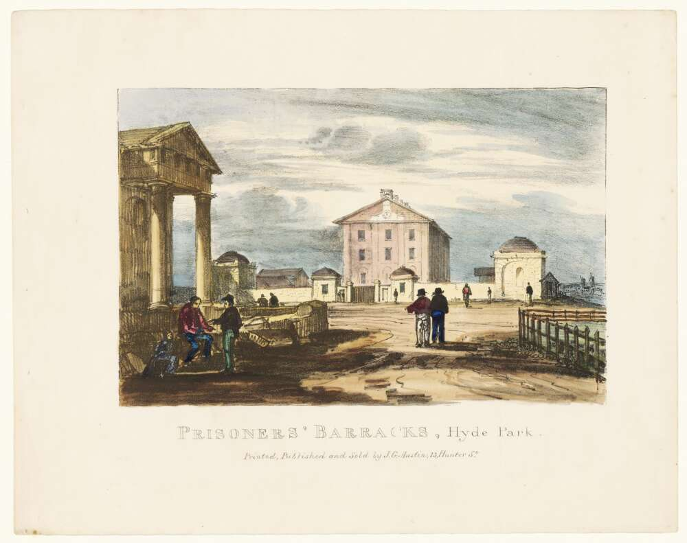

# Hyde Park Barracks

<http://www.environment.nsw.gov.au/heritageapp/ViewHeritageItemDetails.aspx?ID=5045722>

<http://nla.gov.au/nla.obj-135277601>

Hyde Park Barracks was built on the instruction of Governor Macquarie between 1817 and 1819.
He saw the desirablilty of some secure night lodging for government assigned male convicts for surveillance and as a means to control their labour for his ambitious building program.
The barracks was officially opened on 4 June 1819 and thereafter the central building served as a dormitory for an average of 600 men.

The first proposal for Hyde Park Barracks to be made a museum came in 1935 but met with no response, nor did proposals for its demolition.
Following the rekindling of the notion of museums in the 1970s, the decision was made to keep the building was made in 1975.
